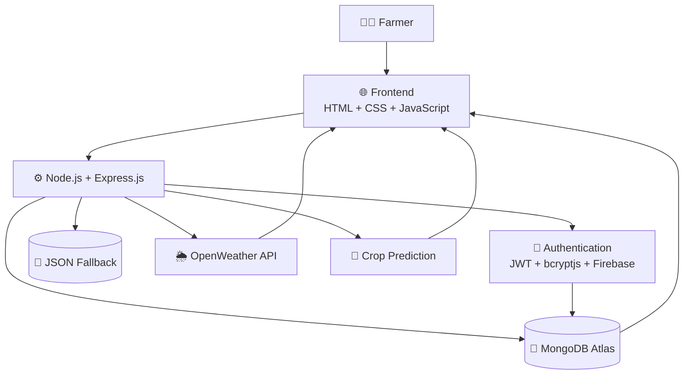
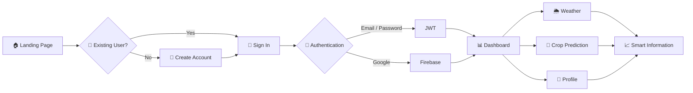
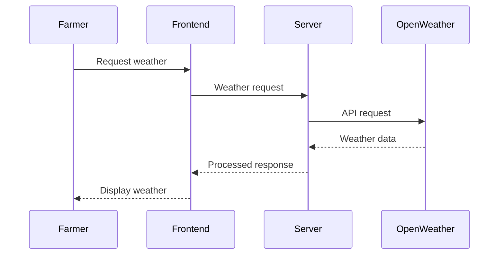

<div align="center">

# 🌾 AI Smart Farmer

### `AI • Agriculture • Weather Intelligence • Full-Stack`


<br>

[](https://github.com/Rudrapratap0005/AI_Smart_Farmer)
[](https://nodejs.org/)
[](https://expressjs.com/)
[](https://www.mongodb.com/)
[](https://firebase.google.com/)
[](https://render.com/)

<br><br>

> 🌱 **A full-stack agricultural platform that combines AI-based crop prediction, real-time weather information and personalized farmer services into one application.**

</div>

---

## 🧭 Quick Navigation

**[✨ Features](#-features) · [🏗️ Architecture](#️-system-architecture) · [🔐 Authentication](#-authentication) · [🌱 AI Module](#-ai--crop-prediction) · [🌦️ Weather](#️-weather-intelligence) · [🛠️ Tech Stack](#️-technology-stack) · [📂 Structure](#-project-structure) · [🚀 Setup](#-installation) · [☁️ Deployment](#️-deployment) · [🔮 Roadmap](#-roadmap)**

---

# 🌾 What is AI Smart Farmer?

**AI Smart Farmer** is a full-stack web application focused on making agricultural information more accessible through modern software and AI-based decision support.

Instead of requiring farmers to use multiple platforms, the application brings important functionality together:

```text
                    👨‍🌾 FARMER
                       │
                       ▼
              ┌─────────────────┐
              │  AI SMART FARMER│
              └─────────────────┘
                       │
        ┌──────────────┼──────────────┐
        ▼              ▼              ▼
   🤖 AI Crop       🌦️ Weather      👤 Profile
    Prediction      Intelligence   Management
        │              │              │
        └──────────────┼──────────────┘
                       ▼
                📊 Smart Insights
                       │
                       ▼
                 🌾 Better Decisions
```

---

# ✨ Features

<table>
<tr>
<td width="50%">

### 🤖 AI Crop Prediction

Data-driven crop recommendation designed to assist agricultural decision-making.

</td>
<td width="50%">

### 🌦️ Weather Intelligence

Real-time weather information powered by the OpenWeather API.

</td>
</tr>

<tr>
<td>

### 🔐 Secure Authentication

JWT-based authentication with password hashing using bcryptjs.

</td>
<td>

### 🔑 Google Sign-In

Firebase authentication support for Google-based login.

</td>
</tr>

<tr>
<td>

### 📊 Farmer Dashboard

Centralized dashboard for accessing important application information.

</td>
<td>

### 👤 Profile System

Multiple profile templates and personalized user information.

</td>
</tr>

<tr>
<td>

### 🍃 MongoDB Atlas

Cloud database integration using MongoDB and Mongoose.

</td>
<td>

### 💾 JSON Fallback

Lightweight JSON-based fallback data storage for local development/testing.

</td>
</tr>
</table>

---

# 🧠 What Makes It Different?

The project is not just a static agriculture website.

It connects several application layers:

```text
       USER
        │
        ▼
   FRONTEND UI
        │
        ▼
   EXPRESS API
        │
   ┌────┼─────┬──────────┐
   ▼    ▼     ▼          ▼
  JWT  AI   WEATHER    DATABASE
   │    │     │          │
   └────┴─────┴──────────┘
        │
        ▼
  PERSONALIZED
   EXPERIENCE
```

This creates a foundation that can be expanded into a larger digital farming platform.

---

# 🏗️ System Architecture



---

# 🔄 Complete User Journey



---

# 🔐 Authentication

AI Smart Farmer uses multiple authentication mechanisms.

## Email / Password

```text
User
 │
 ▼
Email + Password
 │
 ▼
Express Backend
 │
 ▼
Validate Credentials
 │
 ▼
bcryptjs
 │
 ▼
Password Verification
 │
 ▼
JWT Token
 │
 ▼
Authenticated User
```

## Google Authentication

```text
User
 │
 ▼
Google Sign-In
 │
 ▼
Firebase Authentication
 │
 ▼
Authenticated Identity
 │
 ▼
Application
```

### Security Technologies

| Technology | Purpose                       |
| ---------- | ----------------------------- |
| JWT        | User authentication           |
| bcryptjs   | Password hashing              |
| Firebase   | Google authentication         |
| dotenv     | Environment configuration     |
| CORS       | Cross-origin request handling |

---

# 🤖 AI / Crop Prediction

The crop prediction module is one of the central concepts of the application.

```text
🌾 Agricultural Inputs
        │
        ▼
   Application
        │
        ▼
 Crop Prediction
     Logic
        │
        ▼
🌱 Recommended Crop
        │
        ▼
    Dashboard
```

### Future AI Expansion

The architecture can be extended with:

```text
Current System
      │
      ▼
Machine Learning Model
      │
 ┌────┼─────┬─────────┐
 ▼    ▼     ▼         ▼
Soil Weather Season  Location
 │
 ▼
Crop Recommendation
```

---

# 🌦️ Weather Intelligence

Weather data is obtained through the **OpenWeather API**.



---

# 📊 Data Flow

```text
                   USER INPUT
                       │
                       ▼
                ┌─────────────┐
                │  FRONTEND   │
                └──────┬──────┘
                       │
                       ▼
                ┌─────────────┐
                │   EXPRESS   │
                │    SERVER   │
                └──────┬──────┘
                       │
          ┌────────────┼────────────┐
          ▼            ▼            ▼
       MongoDB       Weather       AI
        Atlas          API       Prediction
          │            │            │
          └────────────┼────────────┘
                       ▼
                ┌─────────────┐
                │  RESPONSE   │
                └──────┬──────┘
                       │
                       ▼
                📊 DASHBOARD
```

---

# 🛠️ Technology Stack

## Frontend

<p>


</p>

## Backend

<p>


</p>

## Database

<p>


</p>

## Authentication & Services

<p>


</p>

## Deployment

<p>


</p>

---

# 📂 Project Structure

```text
AI_Smart_Farmer/
│
├── 📂 data/
│   ├── predictions.json
│   └── users.json
│
├── 📂 models/
│   ├── CropData.js
│   └── User.js
│
├── 📂 public/
│   ├── 📂 css/
│   ├── 📂 js/
│   ├── 📂 pages/
│   │
│   ├── CreateAcc.html
│   ├── Dashboard.html
│   ├── Profile.html
│   ├── ProfileT1.html
│   ├── ProfileT2.html
│   ├── ProfileT3.html
│   ├── SignIn.html
│   ├── about.html
│   ├── faq.html
│   ├── firebase.js
│   └── index.html
│
├── 📂 src/
│   ├── 📂 config/
│   ├── 📂 lib/
│   ├── 📂 middleware/
│   ├── 📂 routes/
│   └── app.js
│
├── .gitignore
├── package.json
├── package-lock.json
├── render.yaml
├── server.js
└── README.md
```

---

# 🧩 Core Modules

```text
AI SMART FARMER
│
├── 🔐 Authentication
│   ├── Registration
│   ├── Login
│   ├── JWT
│   ├── bcryptjs
│   └── Google Authentication
│
├── 🤖 AI
│   └── Crop Prediction
│
├── 🌦️ Weather
│   └── OpenWeather API
│
├── 📊 Dashboard
│   └── Farmer Information
│
├── 👤 Profile
│   ├── Profile
│   ├── Profile T1
│   ├── Profile T2
│   └── Profile T3
│
├── 🗄️ Database
│   ├── MongoDB
│   └── JSON Fallback
│
└── ☁️ Deployment
    └── Render
```

---

# 🔌 API

### Health Check

```http
GET /health
```

### Register

```http
POST /api/auth/register
```

### Login

```http
POST /api/auth/login
```

### Protected Requests

```http
Authorization: Bearer <JWT_TOKEN>
```

---

# 🗄️ Database Layer

MongoDB Atlas is used as the primary database.

### Main Models

```text
models/
│
├── User.js
│
└── CropData.js
```

### Data Architecture

```text
             Application
                  │
                  ▼
             Mongoose
                  │
                  ▼
           MongoDB Atlas
                  │
        ┌─────────┴─────────┐
        ▼                   ▼
     User Data          Crop Data
```

---

# 💾 Fallback Data Layer

For lightweight development/testing, the project also contains JSON-based data:

```text
data/
├── users.json
└── predictions.json
```

This provides a simple local data layer alongside the cloud database architecture.

---

# 📱 Frontend Pages

| Page             | Purpose                    |
| ---------------- | -------------------------- |
| `index.html`     | Main landing page          |
| `SignIn.html`    | Login interface            |
| `CreateAcc.html` | Account creation           |
| `Dashboard.html` | Main farmer dashboard      |
| `Profile.html`   | User profile               |
| `ProfileT1.html` | Profile template           |
| `ProfileT2.html` | Profile template           |
| `ProfileT3.html` | Profile template           |
| `about.html`     | About project              |
| `faq.html`       | Frequently asked questions |

---

# 🚀 Installation

## Clone

```bash
git clone https://github.com/Rudrapratap0005/AI_Smart_Farmer.git
```

## Move into project

```bash
cd AI_Smart_Farmer
```

## Install dependencies

```bash
npm install
```

## Configure `.env`

```env
PORT=5000
MONGO_URI=your_mongodb_connection_string
JWT_SECRET=your_secret_key
OPENWEATHER_API_KEY=your_api_key
```

## Run Development Server

```bash
npm run dev
```

## Run Production Server

```bash
npm start
```

Open:

```text
http://localhost:5000
```

---

# ☁️ Deployment

The application is configured for deployment using **Render**.

```text
              GitHub
                 │
                 ▼
              Render
                 │
        ┌────────┴────────┐
        ▼                 ▼
   Node.js Server    Environment
                       Variables
        │
   ┌────┴─────┐
   ▼          ▼
MongoDB    OpenWeather
 Atlas        API
   │
   └──────┬──────┘
          ▼
      🌾 LIVE APP
```

---

# 📈 Project Growth Roadmap

```text
                AI SMART FARMER
                       │
        ┌──────────────┼──────────────┐
        ▼              ▼              ▼
       AI           WEATHER        FARMER
     SYSTEM        INTELLIGENCE    SERVICES
        │              │              │
        ▼              ▼              ▼
   Prediction       Forecasts       Profiles
        │              │              │
        └──────────────┼──────────────┘
                       ▼
                 SMART FARMING
```

---

# 🔮 Roadmap

### ✅ Completed

* [x] Landing page
* [x] User registration
* [x] User login
* [x] JWT authentication
* [x] Password hashing
* [x] Google authentication
* [x] MongoDB integration
* [x] Crop prediction
* [x] Weather integration
* [x] Farmer dashboard
* [x] Profile system
* [x] JSON fallback data
* [x] Render deployment

### 🚧 Future

* [ ] Advanced ML prediction models
* [ ] Historical weather analytics
* [ ] Interactive agricultural charts
* [ ] Multilingual support
* [ ] Voice-based farmer assistant
* [ ] Mobile application
* [ ] Soil sensor / IoT integration
* [ ] Disease detection using computer vision
* [ ] Personalized farming recommendations
* [ ] Agricultural market information

---

# 🏆 GitHub Project Stats

<div align="center">

<a href="https://github.com/Rudrapratap0005/AI_Smart_Farmer">

</a>

<br><br>


</div>

---

# 🏅 Developer GitHub Stats

<div align="center">

<a href="https://github.com/Rudrapratap0005">


</a>

</div>

---

# 🏆 GitHub Trophy Wall

<div align="center">


</div>

---

# 📊 Contribution Activity

<div align="center">


</div>

---

# 👨‍💻 Developer

<div align="center">

### Rudrapratap Shukla

**Full-Stack Developer | AI/ML Enthusiast**

<a href="https://github.com/Rudrapratap0005">

</a>

</div>

---

# 🤝 Contributing

Contributions, ideas and improvements are welcome.

```bash
git clone https://github.com/Rudrapratap0005/AI_Smart_Farmer.git

cd AI_Smart_Farmer

git checkout -b feature/your-feature

git add .

git commit -m "Add: your feature"

git push origin feature/your-feature
```

Then open a Pull Request.

---

# ⭐ Show Your Support

If you find this project interesting:

⭐ **Star the repository**

🍴 **Fork the repository**

🐛 **Report an issue**

💡 **Suggest a feature**

🤝 **Contribute**

---

<div align="center">

## 🌱 Smart Technology for Smarter Farming

### `AI + Data + Weather + Agriculture`

<br>


<br><br>

**Built with ❤️ by Rudrapratap Shukla**

</div>
